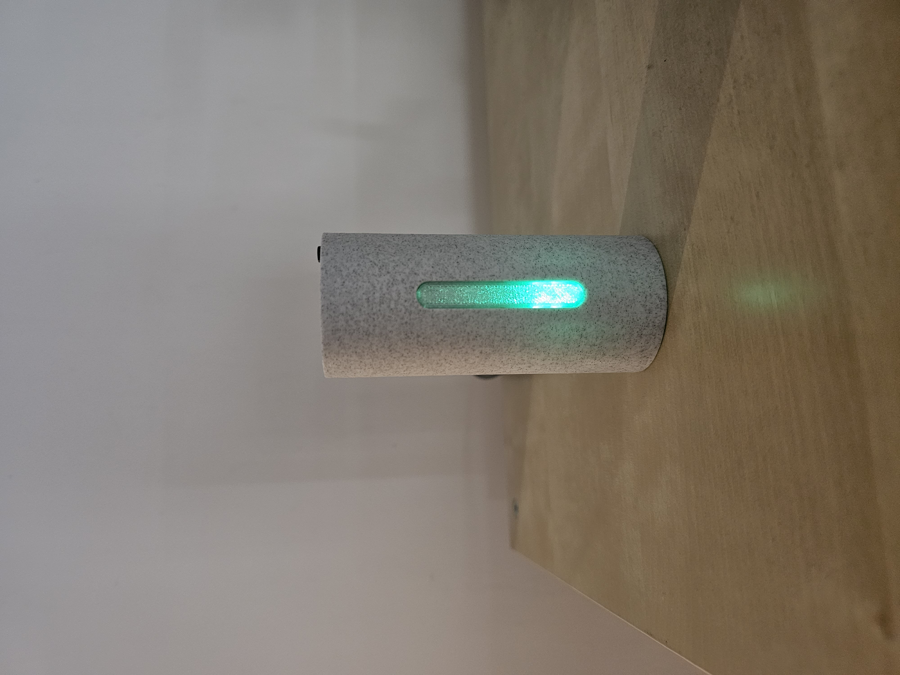
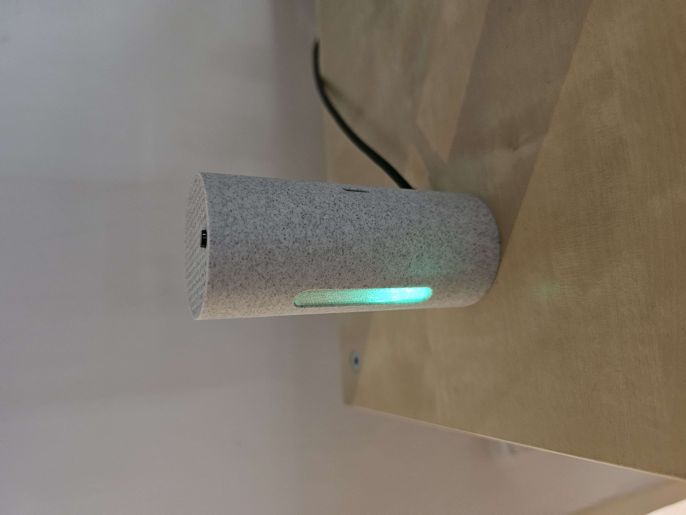
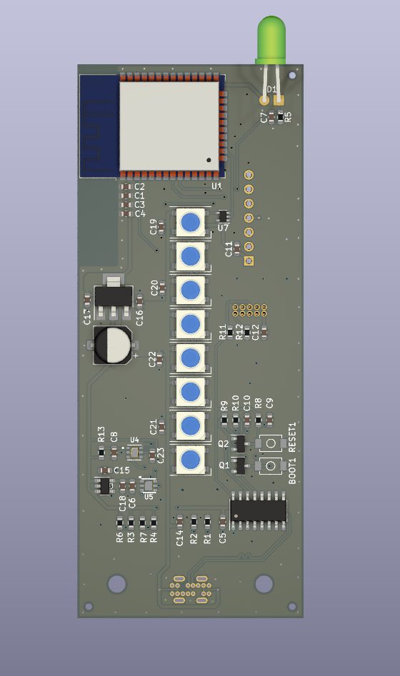
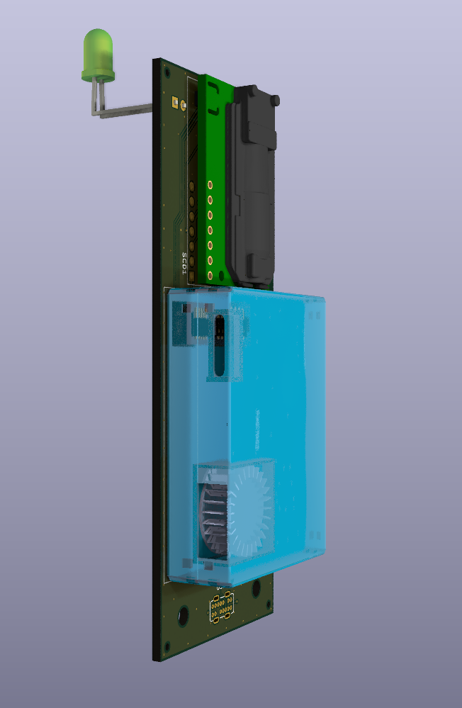

# AirquaLLity-esphome

Air-quality sensor (CO2, particulate matter, ...) in a nice 3D printed package with LED bar visualization. Using ESPHome, compatible with HomeAssitant.


## Images

[](images/front.jpg)
[](images/side.jpg)

[](images/board_front.png)
[](images/board_side.png)

## Features
- Wi-Fi
- RGB LED bar for quick visual air-quality indication
- HomeAssistant compatible

### Sensors:
 - Accurate CO2 using dual NDIR sensor (SCD30) 
 - Particulate matter (<10µm, <2.5µm, <1µm)
 - Temperature
 - Humidity
 - Illumination (amount of light)
 - VOC (Volatile organic compound) sensor
 - NOx sensor


## How to build

Manufactury files available, see schematic/jlcpcb. They can assemble most of the bord, however you'll need to solder at least CO2 sensor & particulate matter sensor yourself.


## Firmware 
 See https://esphome.io/guides/getting_started_command_line.html

- set your Wi-Fi credentials in firmware\secrets.yaml
- go to firmware directory
- Run: ```esphome run llairquality.yaml```


## License

See [LICENSE](LICENSE)